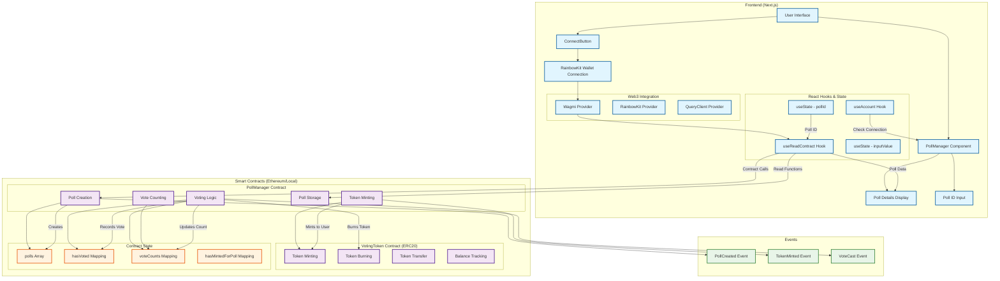
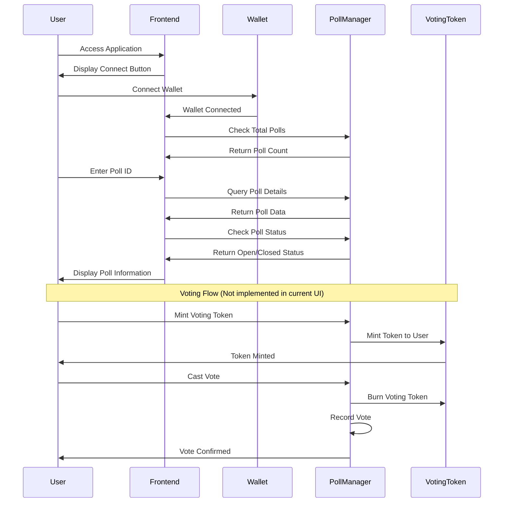
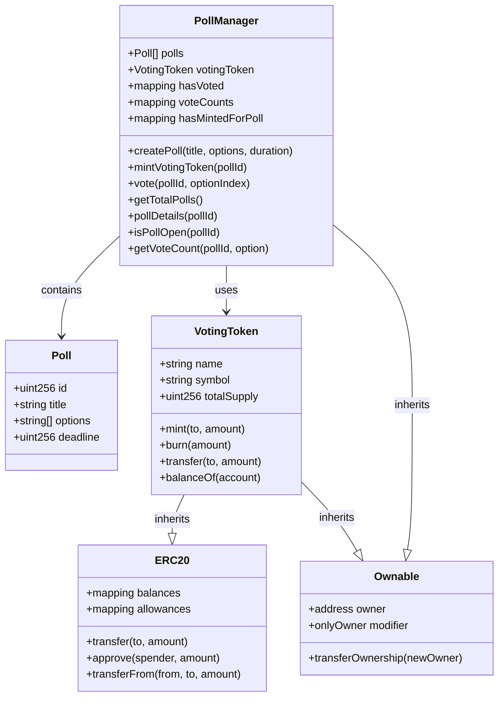
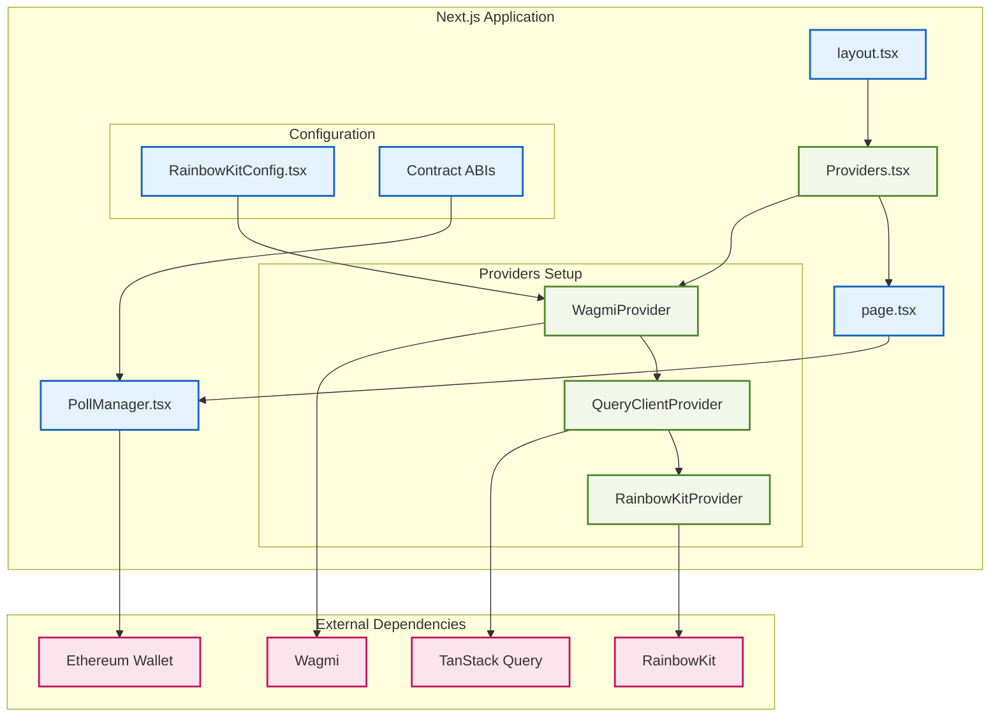

# Decentralized Voting System Architecture

## System Overview

This Mermaid diagram illustrates the architecture and flow of the decentralized voting system built with Solidity smart contracts and Next.js frontend.

## User Flow Diagram

## Smart Contract Architecture

## Component Architecture

## Key Features & Functions

### Smart Contract Functions

- **Poll Management**: Create polls with title, options, and deadline
- **Token System**: ERC20 voting tokens minted per poll
- **Voting Logic**: One vote per token, token burned after voting
- **Access Control**: Owner-only poll creation
- **State Tracking**: Vote counts, user participation status

### Frontend Features

- **Wallet Integration**: RainbowKit for seamless wallet connection
- **Real-time Data**: Live poll status and details fetching
- **Responsive UI**: Modern design with Tailwind CSS
- **Error Handling**: Comprehensive error states and loading indicators
- **Poll Display**: Detailed poll information including status and deadline

### Technology Stack

- **Smart Contracts**: Solidity, Foundry, OpenZeppelin
- **Frontend**: Next.js, TypeScript, Tailwind CSS
- **Web3 Integration**: Wagmi, RainbowKit, TanStack Query
- **Development**: Local Ethereum node, TypeScript configuration
